# ChitChat - Join the conversation!

## Table of Contents
- [Introduction](#introduction)
- [Features](#features)
- [Recreating the Project](#recreating-the-project)
- [Validations](#validations)
- [Responsivity](#responsivity)
- [Repository Management](#repository-management)
- [Use of AI](#use-of-ai)
- [Technologies Used](#technologies-used)
- [Contributing](#contributing)
- [License](#license)
- [Contact](#contact)

## Project Overview
Chitchat is a a lightweight, function complete, high-design messaging app for informal conversation, lighthearted discussion and
positive energy. Our app is designed to be the perfect companion for those looking to engage in a chat with a clean, comfortable 
interface. It uses a design that evokes post-it notes, lending a familiarity and evoking ideas of ease and usability. User experience 
is prioritised, ensuring that every interaction is seamless and enjoyable. The app is functionally complete, meaning it includes all 
the essential features you need without unnecessary complexity, including full CRUD functionality. Our app can be used to catch up with 
friends, share a laugh, or simply spread some positivity. Our app provides the ideal platform to connect and communicate with ease, and 
without any feature bloat. Embracing simplicity and joy, it fosters a welcoming and energetic atmosphere where every chat feels 
effortless and fun.

## Features
- User authentication (sign up, login, logout)
- Create, read, update, and delete posts
- Comment on posts
- Responsive design
- User profile management


## Recreating the project
1. Clone the repo to your local machine with git clone
2. Set up a venv with python -m venv venv and activate it with your OS specific method
3. Install requirements with pip install -r requirements.txt
4. Create a file named env.py in the project root directory and add the necessary      environment variables.
```
os.environ['DATABASE_URL'] = 'your_database_url_here'
os.environ['SECRET_KEY'] = 'your_secret_key_here'
```
5. Make sure to add #import env to settings.py
6. Use python manage.py migrate to build the database schema
7. Create a superuser with python manage.py createsuperuser
8. Run the development server with python manage.py runserver
9. Open your web browser and go to http://localhost:8000 to access the application.

## Validations

Lighthouse output was as follows - 

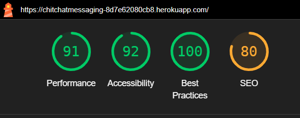

And WAVE tested as below - 

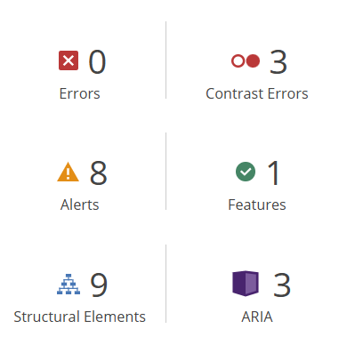

The contrast alerts are caused by the way images are used to achieve a white on black effect, and the text is high-contrast from a user
view, see below - 

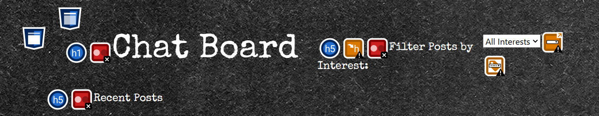

## ERD

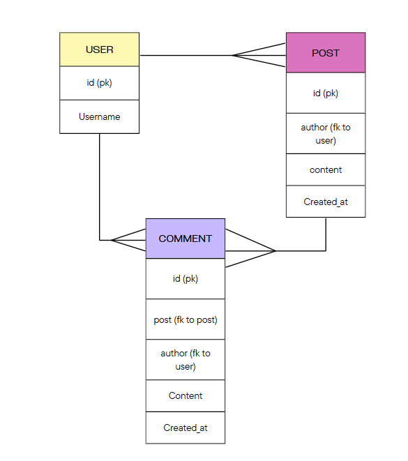

This shows the models that were ideated for our project. 'User' extends Django's built in user model. 

## Deployment

Deployment was handled on Heroku. This necessitated the creation of a Procfile, used to specify guinicon handling, and the setting of 
environment variables on that platform, namely DISABLE_COLLECTSTATIC and SECRET_KEY. 
Deploying in this way also meant static files had to be served by some external service, and for this purpose Whitenoise was installed,
and the approprite lines added to settings.py (below)
```
STATIC_URL = 'static/'
STATIC_ROOT = os.path.join(BASE_DIR, 'staticfiles')

STATICFILES_DIRS = (os.path.join(BASE_DIR, 'static'),)
STATICFILES_STORAGE = 'whitenoise.storage.CompressedManifestStaticFilesStorage'
```

Secret key handling was performed locally by defining a %SECRET_KEY% as a global enviroment variable, and adding env.py to gitignore,
ensuring that the secret key has never been in a publicly accesable place, either on Heroku or in the public development repository.

## Visual Design  
We decided that we would be going for a clean, casual, easy feel and post-it notes is the ideal manifestation of that idea of casual, 
short messaaging and information distribution. To realise this, the following designs were ideated - 

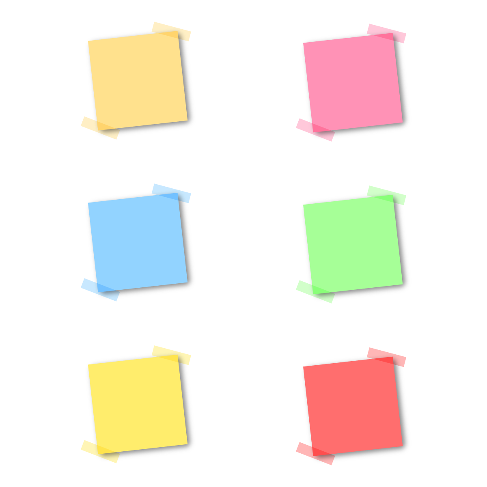

Were arrived at for the colours, with a pastel theme for ease of viewing and broad appeal.

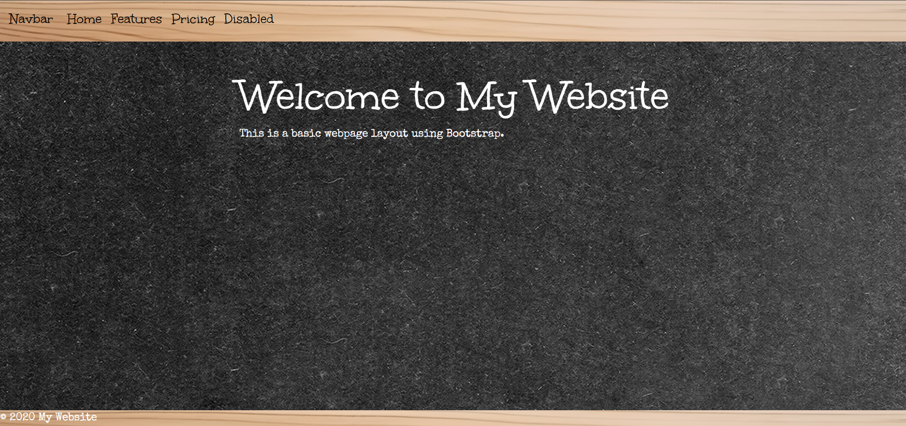

And this background, to again strengthen the themes of comfortable, familiar methods of leaving short messages, a literal noticeboard. 
The combined look of the elements is provided below, showing design evoloutions such as subtle shadowing to show a 3d effect, and a 
revised pallette for greater visual clarity.

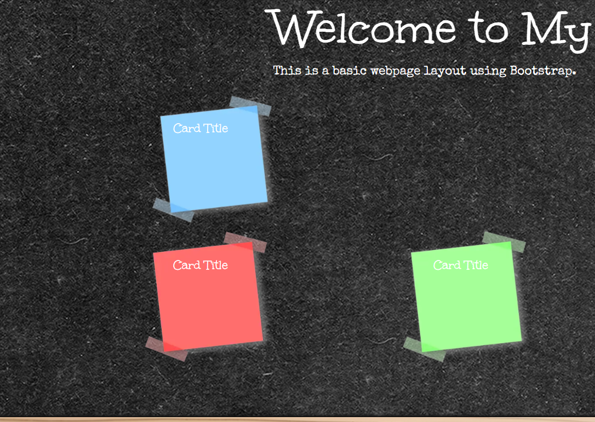

## Functional design - a snapshot

Below are compared two views of the database design phase of the project, showing logged in and logged out views, highlighting the 
ability for only logged in users to make a post. This phase was moved through quickly, and is included to demonstrate evolution of 
database policies, requiring appropriate migration management. 

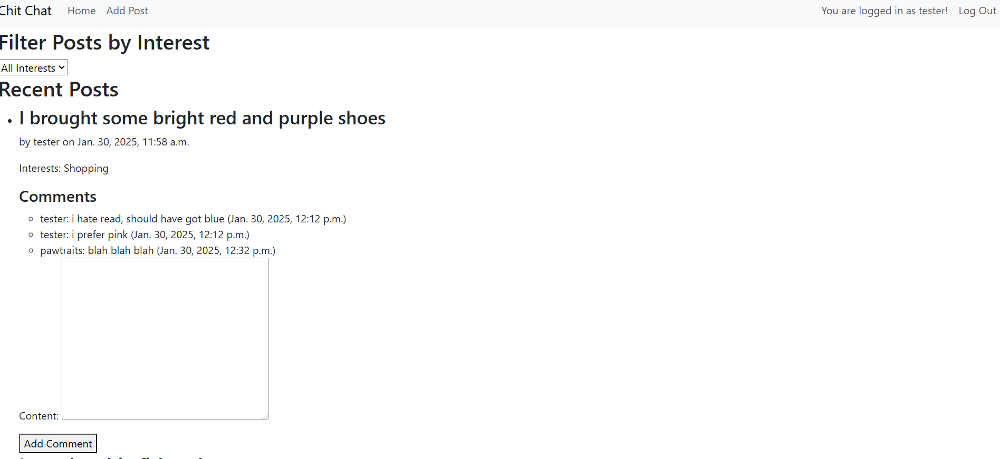
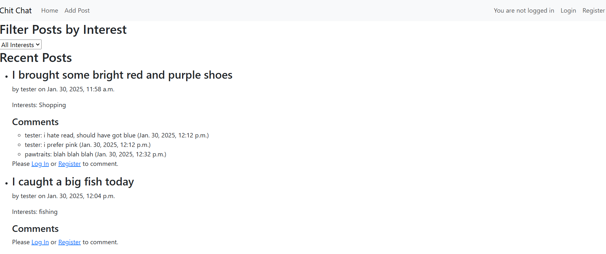

## Unit testing

Unit tests below were generated to test our custom user model, post model and comment model.

```
class CustomUserModelTest(TestCase):

    def setUp(self):
        self.user = User.objects.create_user(username='testuser', first_name='Test', last_name='User', password='password')

    def test_full_name(self):
        self.assertEqual(self.user.get_full_name(), 'Test User')


class PostModelTest(TestCase):

    def setUp(self):
        self.user = User.objects.create_user(username='testuser', password='password')
        self.post = Post.objects.create(author=self.user, content='This is a test post', interests='Testing')

    def test_post_creation(self):
        self.assertEqual(self.post.author.username, 'testuser')
        self.assertEqual(self.post.content, 'This is a test post')
        self.assertEqual(self.post.interests, 'Testing')
        self.assertIsNotNone(self.post.created_at)

    def test_post_str(self):
        self.assertEqual(str(self.post), f"Post by {self.post.author.username} at {self.post.created_at}")


class CommentModelTest(TestCase):

    def setUp(self):
        self.user = User.objects.create_user(username='testuser', password='password')
        self.post = Post.objects.create(author=self.user, content='This is a test post')
        self.comment = Comment.objects.create(post=self.post, author=self.user, content='This is a test comment')

    def test_comment_creation(self):
        self.assertEqual(self.comment.post, self.post)
        self.assertEqual(self.comment.author.username, 'testuser')
        self.assertEqual(self.comment.content, 'This is a test comment')
        self.assertIsNotNone(self.comment.created_at)

    def test_comment_str(self):
        self.assertEqual(str(self.comment), f"Comment by {self.comment.author.username} at {self.comment.created_at}")
```
All tests passed succesfully, with output as below

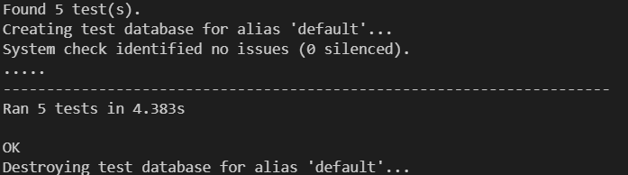

## Responsivity

The navbar compresses to a menu button on screens with smaller resolutions, and larger
 screens are catered to with bootstrapped spacing of posts preserving proper aspect 
ratios.

## Repository management

This project makes use of internal repositories, which appear as below: -

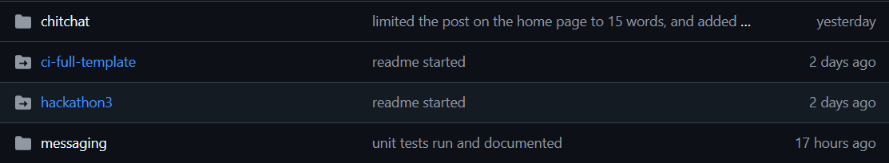

The method for creation is as follows - 
1. Clone or create a repo to a directory, with VScode or git init
2. Create a subdirectory, and navigate to it with `cd <subdirectory name>`
3. Perfom  another git init.
4. Navigate back to the primary git with `cd ..`

In local VScode, these repositories exist as directories, with files able to be moved freely between them. However, when the primary 
git is pushed, no changes to the internal git are included. Further, no referenece method exists (deliberately) for a primary repo to 
reference files or folders within an internal repo. Along with not being able to cross-link code between them, this also means that the 
contents of the internal repo are not visible.<br>

In this project, internal repos were used to keep an immediately accesible folder to backup files, particularly `env.py`, that can be
lost in a recloning of a project git. As the pull cannot change the contents of internal repos, the backup `env.py` will be untouched.
The CI template was backed up to ensure file matching.

## Use of AI
>1. Debugging Django Errors: Assisted in troubleshooting and fixing issues related to Django's WSGI application configuration.
>2. Improving README: Suggested additional sections and content to make the README file more comprehensive and user-friendly.
>3. Unit Testing: Provided unit tests for the Django models to ensure they function correctly.
>4. URL Patterns: Reviewed and corrected URL patterns to ensure proper routing for adding comments.
>5. Template Updates: Suggested updates to Django templates to ensure proper functionality and user experience.

The above is a brief reflection by Copilot on its own contribution to the project. It was also utilised to help with generating user stories, and for simple suggestions to be elaborated on during ideation.

## Technologies Used
- Django
- Bootstrap
- PostGRES
- HTML/CSS
- JavaScript

## User Stories
As a user, I want to send Post-it note messages to my friends.

As a user, I want to change the color of my Post-it notes.

As a user, I want to receive notifications for new Post-it notes.

As a user, I want to delete my Post-it note messages.

As a user, I want to edit my Post-it note messages.

As an admin, I want a built-in backend to view the database

