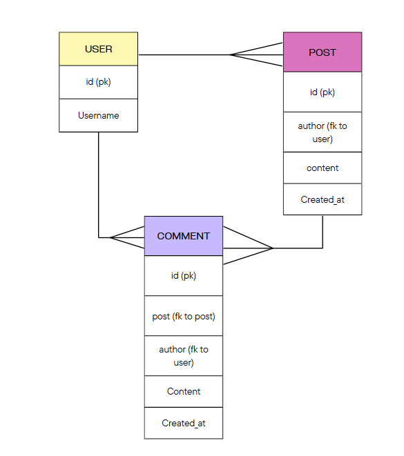

# ChitChat - Join the conversation!

## Project Overview
Chitchat is a a lightweight, function complete, high-design messaging app for informal conversation, lighthearted discussion and
positive energy. Our app is designed to be the perfect companion for those looking to engage in a chat with a clean, comfortable 
interface. It uses a design that evokes post-it notes, lending a familiarity and evoking ideas of ease and usability. User experience 
is prioritised, ensuring that every interaction is seamless and enjoyable. The app is functionally complete, meaning it includes all 
the essential features you need without unnecessary complexity, including full CRUD functionality. Our app can be used to catch up with 
friends, share a laugh, or simply spread some positivity. Our app provides the ideal platform to connect and communicate with ease, and 
without any feature bloat. Embracing simplicity and joy, it fosters a welcoming and energetic atmosphere where every chat feels 
effortless and fun.

## Recreating the project
1. Clone the repo to your local machine with git clone
2. Set up a venv with python -m venv venv and activate it with your OS specific method
3. Install requirements with pip install -r requirements.txt
4. Create a file named env.py in the project root directory and add the necessary      environment variables.
```
os.environ['DATABASE_URL'] = 'your_database_url_here'
os.environ['SECRET_KEY'] = 'your_secret_key_here'
```
5. Make sure to add #import env to settings.py
6. Use python manage.py migrate to build the database schema
7. Create a superuser with python manage.py createsuperuser
8. Run the development server with python manage.py runserver
9. Open your web browser and go to http://localhost:8000 to access the application.

## ERD



This shows the models that were ideated for our project.